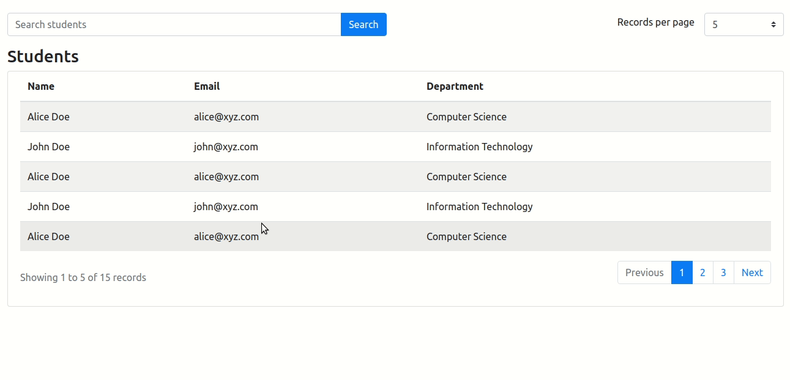

# Server side Pagination with search in React

This project includes fully customizable server-side pagination component along with search feature without using any third party pagination library.

## Stack
- react
- typescript
- nodejs
- react-bootstrap
- react-hook-form
- axios
- node-sass

## Give a Star ⭐
If you liked this project or found it helpful then please give it a star. It will keep motivating me do more work like this! Thanks.

## Demo Output

## Outline
- Pagination supportive API
- Reusable pagination component
- Generic pager service for calculating pager data
- Parent component containing table for consuming pagination component

## Share & Care

If you think this project is helpful share it on [Twitter](https://twitter.com/intent/tweet?url=https://github.com/navanathjadhav/generic-pagination)

## Read More
View detailed article on Ever Blogs: [3 Simple steps to add pagination in React | Ever Blogs](https://everblogs.com/react/3-simple-steps-to-add-pagination-in-react/)
 
Please visit [Ever Blogs](https://everblogs.com/) to read interesting blogs on other Technologies.

## Available Scripts

In the project directory, you can run:

### `yarn start`

Runs the app in the development mode.\
Open [http://localhost:3000](http://localhost:3000) to view it in the browser.

The page will reload if you make edits.\
You will also see any lint errors in the console.

### `yarn server:start`

Runs the Node server for Mock API on [http://localhost:4000]

`Note: Make sure you have node installed in your computer`

### `yarn test`

Launches the test runner in the interactive watch mode.\
See the section about [running tests](https://facebook.github.io/create-react-app/docs/running-tests) for more information.

### `yarn build`

Builds the app for production to the `build` folder.\
It correctly bundles React in production mode and optimizes the build for the best performance.

The build is minified and the filenames include the hashes.\
Your app is ready to be deployed!
